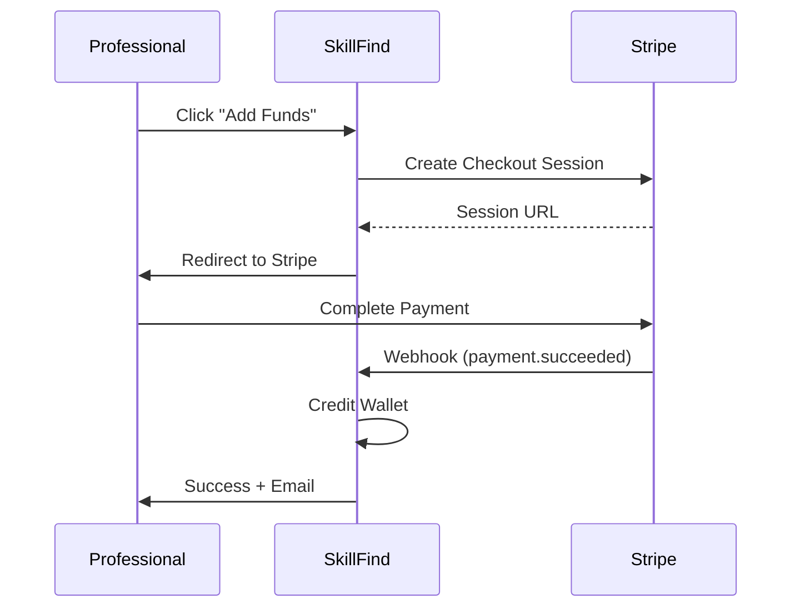

# Stripe Integration & Payment System Implementation Plan

## Executive Summary

This plan outlines the complete integration of Stripe payments to enable:
1. **Wallet Top-ups** - Professionals can add funds via Stripe
2. **Pay-Per-Click Billing** - Automatic deductions when clients view offers
3. **Transaction Tracking** - Complete history and receipts

---

## Current State Analysis

### ✅ Already Implemented

| Component | Status | Location |
|-----------|--------|----------|
| Wallet Model | ✅ Complete | `prisma/schema.prisma` |
| Transaction Model | ✅ Complete | `prisma/schema.prisma` |
| ClickEvent Model | ✅ Complete | `prisma/schema.prisma` |
| Wallet Service | ✅ Complete | `src/lib/services/wallet.ts` |
| Deposit API (Stub) | ✅ Stub | `src/app/api/wallet/deposit/route.ts` |
| Webhook Handler (Stub) | ✅ Stub | `src/app/api/wallet/webhook/route.ts` |
| Click Recording API | ✅ Complete | `src/app/api/clicks/route.ts` |
| Wallet UI | ✅ Complete | `src/app/[locale]/pro/wallet/page.tsx` |
| Transaction List | ✅ Complete | `src/app/api/wallet/transactions/route.ts` |

### 🔴 Missing (Requires Stripe)

| Component | Priority |
|-----------|----------|
| Stripe SDK Installation | HIGH |
| Stripe Payment Intent Creation | HIGH |
| Stripe Checkout Session | HIGH |
| Webhook Signature Verification | HIGH |
| Customer Creation | MEDIUM |
| Receipt Generation | LOW |

---

## Phase 1: Stripe Setup (30 min)

### 1.1 Install Stripe SDK

```bash
npm install stripe @stripe/stripe-js
```

### 1.2 Environment Variables

Add to `.env`:

```env
# Stripe Configuration
STRIPE_SECRET_KEY=sk_test_...
STRIPE_PUBLISHABLE_KEY=pk_test_...
STRIPE_WEBHOOK_SECRET=whsec_...
```

### 1.3 Create Stripe Client

#### [NEW] [stripe.ts](file:///c:/Users/hassn/skillfind/src/lib/stripe.ts)

```typescript
import Stripe from 'stripe';

if (!process.env.STRIPE_SECRET_KEY) {
  throw new Error('STRIPE_SECRET_KEY is not set');
}

export const stripe = new Stripe(process.env.STRIPE_SECRET_KEY, {
  apiVersion: '2024-12-18.acacia',
  typescript: true,
});
```

---

## Phase 2: Payment Flow Implementation (1-2 hours)

### 2.1 Deposit Flow



### 2.2 Update Deposit API

#### [MODIFY] [route.ts](file:///c:/Users/hassn/skillfind/src/app/api/wallet/deposit/route.ts)

Replace stub with real Stripe integration:

```typescript
import { stripe } from '@/lib/stripe';

// Create Stripe Checkout Session
const session = await stripe.checkout.sessions.create({
  mode: 'payment',
  payment_method_types: ['card'],
  line_items: [{
    price_data: {
      currency: 'eur',
      unit_amount: data.amount, // in cents
      product_data: {
        name: 'Wallet Top-up',
        description: `Add €${(data.amount / 100).toFixed(2)} to your SkillFind wallet`,
      },
    },
    quantity: 1,
  }],
  success_url: `${baseUrl}/pro/wallet?success=true`,
  cancel_url: `${baseUrl}/pro/wallet?canceled=true`,
  metadata: {
    professionalId: professional.id,
    transactionId: transaction.id,
  },
});

return successResponse({
  paymentUrl: session.url,
  sessionId: session.id,
});
```

### 2.3 Update Webhook Handler

#### [MODIFY] [route.ts](file:///c:/Users/hassn/skillfind/src/app/api/wallet/webhook/route.ts)

Add signature verification:

```typescript
import { stripe } from '@/lib/stripe';

const sig = request.headers.get('stripe-signature');
const webhookSecret = process.env.STRIPE_WEBHOOK_SECRET!;

let event: Stripe.Event;
try {
  event = stripe.webhooks.constructEvent(body, sig!, webhookSecret);
} catch (err) {
  return new Response('Webhook signature verification failed', { status: 400 });
}

// Handle checkout.session.completed
if (event.type === 'checkout.session.completed') {
  const session = event.data.object as Stripe.Checkout.Session;
  await creditWallet({
    professionalId: session.metadata!.professionalId,
    amount: session.amount_total!,
    type: 'DEPOSIT',
    description: `Stripe payment ${session.payment_intent}`,
    referenceId: session.payment_intent as string,
  });
}
```

---

## Phase 3: UI Updates (30 min)

### 3.1 Add Funds Modal

#### [NEW] [AddFundsModal.tsx](file:///c:/Users/hassn/skillfind/src/components/wallet/AddFundsModal.tsx)

Create a modal with predefined amounts:
- €5, €10, €20, €50, Custom amount
- Show current balance
- Redirect to Stripe Checkout

### 3.2 Update Wallet Page

#### [MODIFY] [page.tsx](file:///c:/Users/hassn/skillfind/src/app/[locale]/pro/wallet/page.tsx)

- Wire up "Add Funds" button to modal
- Show success/error toast after redirect
- Handle `?success=true` and `?canceled=true` query params

---

## Phase 4: Pay-Per-Click System (Already Working!)

### Current Implementation ✅

The PPC system is **already fully implemented**:

| Feature | Status | Details |
|---------|--------|---------|
| Click Recording | ✅ | `POST /api/clicks` |
| Wallet Deduction | ✅ | €0.10 per unique view |
| Duplicate Prevention | ✅ | One charge per client |
| Transaction Logging | ✅ | Full audit trail |
| Balance Check | ✅ | Allows negative (can restrict) |

### Optional Enhancements

1. **Block offers if balance < €0** - Currently allows negative
2. **Configurable CPC rate** - Currently hardcoded €0.10
3. **Daily spend limits** - Not implemented

---

## Phase 5: Testing & Verification (30 min)

### 5.1 Test Checklist

- [ ] Stripe test mode works
- [ ] €5 deposit creates checkout session
- [ ] Webhook credits wallet after payment
- [ ] Transaction appears in history
- [ ] Click on offer deducts €0.10
- [ ] Duplicate clicks don't charge twice
- [ ] Low balance warning shows at €2

### 5.2 Stripe CLI for Local Testing

```bash
stripe listen --forward-to localhost:3000/api/wallet/webhook
```

---

## Files to Create/Modify

| Action | File | Description |
|--------|------|-------------|
| CREATE | `src/lib/stripe.ts` | Stripe client singleton |
| CREATE | `src/components/wallet/AddFundsModal.tsx` | Deposit amount selector |
| MODIFY | `src/app/api/wallet/deposit/route.ts` | Real Stripe integration |
| MODIFY | `src/app/api/wallet/webhook/route.ts` | Signature verification |
| MODIFY | `src/app/[locale]/pro/wallet/page.tsx` | Wire up Add Funds button |

---

## Environment Requirements

```env
# Required for Stripe integration
STRIPE_SECRET_KEY=sk_test_...
STRIPE_PUBLISHABLE_KEY=pk_test_...
STRIPE_WEBHOOK_SECRET=whsec_...

# Already should exist
NEXT_PUBLIC_APP_URL=http://localhost:3000
```

---

## Estimated Time

| Phase | Time |
|-------|------|
| Phase 1: Stripe Setup | 30 min |
| Phase 2: Payment Flow | 1-2 hours |
| Phase 3: UI Updates | 30 min |
| Phase 4: PPC (Done) | 0 min |
| Phase 5: Testing | 30 min |
| **Total** | **3-4 hours** |

---

## Next Steps (After Your Approval)

1. Do you have a Stripe account? (Test or Live)
2. Can you provide the API keys?
3. Should we proceed with implementation?

> [!NOTE]
> The PPC system is already fully functional. We only need to integrate Stripe for wallet deposits.
